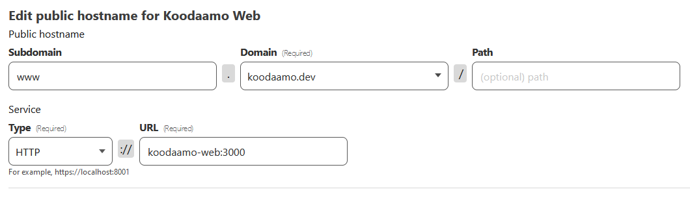

# Koodaamo Web

## Description

This project serves static files using nginx and cloudflared

## Setup

1. Copy the `.env.example` file to a new file named `.env`.
2. Replace the `CLOUDFLARED_TUNNEL_TOKEN` in the `.env` file with your actual token.
3. Run `docker-compose up --build -d` to start the services.

## Services

- `koodaamo-web`: This is the main Nginx server. It serves files from the `/var/www/html` directory.
- `cloudflared`: This service runs a Cloudflare tunnel.

## Cloudflare Tunnel

The Cloudflare tunnel is configured using the `CLOUDFLARED_TUNNEL_TOKEN` environment variable.

## License

[MIT](https://choosealicense.com/licenses/mit/)